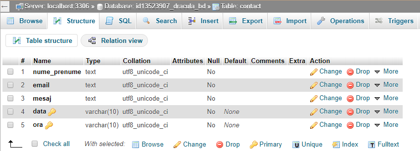
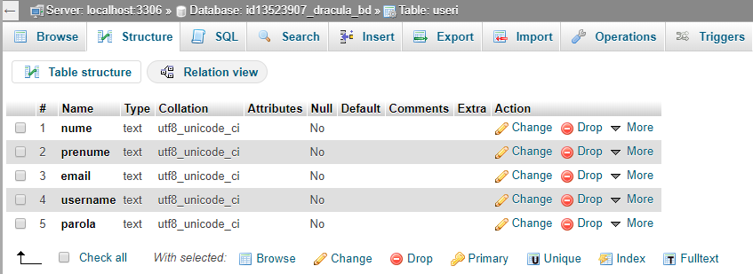
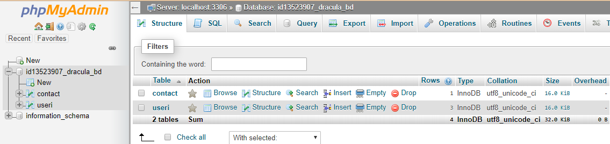

# vlad_tepes
## Ghid de utilizare
Se lansează un browser. 
În bara de adrese, se scrie adresa site-ului: https://vlad-tepes.000webhostapp.com/ 
Pentru a accesa pagina admin va trebui să vă logați cu: Utilizator: admin și Parolă: admin. 
Pentru a accesa pagina propriu-zisă  va trebui să vă logați cu: Utilizator: user și Parolă: user.
## Arhitectura aplicatiei

## Despre pagina
Pagina web creată prezintă ceea ce este important de ştiut despre istoria domnitorului nostru Vlad Țepeș, curiozități privind viața acestuia, mituri, legend și multe alte lucruri interesante.  
Site-ul are o grafică placută, ușor de navigat, fiecare pagină având o legătură directă către pagina principală.  
Am urmărit să proiectez un site atractiv pentru utilizatori. Am alternat tipurile de obiecte pentru a nu deveni monotonă navigarea, iar conținutul l-am prezentat în paragrafe scurte, concise, schematizate. Mesajele sunt ușor de înțeles, iar conținutul informațional este bine structurat.  
Având în vedere că scopul principal al acestui site este acela de a transmite informații, pentru ca acestea să poată fi recepționate de utilizatori, trebuie să fie prezentate într-un mod care facilitează perceperea lor.
## Softul utilizat la proiectarea şi realizarea site-ului
Pentru a realiza pagina web am utilizat limbajele HTML, CSS, JavaScript, PHP şi MySQL.    
Cu ajutorul acestora, am redat informaţiile despre Vlad Țepeș, astfel încât să fie uşor de urmărit şi să capteze atenţia celui care navighează în acest site.                                                                                                            Utilizand PHP am  facut legatura între: tabelele din baza de date și pagina de admin, casetele text “Utilizator” și “Parolă”, din pagina principal, cu tabelul “useri”, mesajele primite de la utilizatorii paginii cu tabelul “contact”.        
În MySQL am creat baza de date “id13523907_dracula_bd”, în care sunt  stocate  tabelele menționate anterior.
## Structuri de date
Baza de date "id13523907_dracula_bd".
Baza de date "id13523907_dracula_bd" conţine 2 tabele: contact şi useri. 

 

  
Gestiunea bazei de date se realizează prin intermediul aplicaţiei phpMyAdmin. 

